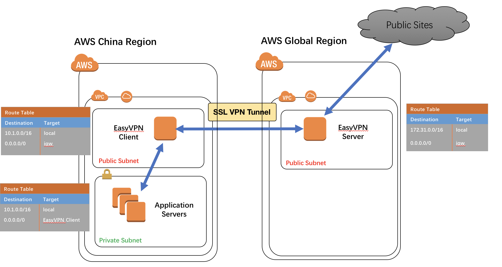

# EasyVPN
Fast ways to setup VPN connections ( Do not use it in a commercial way )

## Objectives
  - [X] 1. CloudFormation template - Json format : 2018/04/28
  - [ ] 2. CloudFormation template - YAML format
  - [X] 3. CloudFormation template - WebConsole support
  - [ ] 4. CloudFormation template - CLI support
  - [ ] 5. CloudFormation template - Python3 support
  - [ ] 6. Terraform format support
  - [ ] 7. Docker support
  
## Manual
### 1. CloudFormation template
 - EasyVPN Server Setup
    - Support regions: Tokyo
    - Server Template: 
      - AWS Global Tokyo: [https://s3-ap-southeast-1.amazonaws.com/leopublic/templates/EasyVPN/EasyVPN_Server.template](https://console.aws.amazon.com/cloudformation/home?region=ap-northeast-1#/stacks/new?stackName=EasyVPNServer&amp;templateURL=https://s3-ap-southeast-1.amazonaws.com/leopublic/templates/EasyVPN/EasyVPN_Server.template) 
	- Select public subnet
    - Get VPNServerIP, PSK from the output after completed lauch
 - EasyVPN Client Setup
    - Support regions: Beijing, Ningxia
    - Client Template: 
      - AWS China Ningxia: [https://s3.cn-north-1.amazonaws.com.cn/leopublic/templates/EasyVPN/EasyVPN_Client.template](https://console.amazonaws.cn/cloudformation/home?region=cn-northwest-1#/stacks/new?stackName=EasyVPNClient&amp;templateURL=https://s3.cn-north-1.amazonaws.com.cn/leopublic/templates/EasyVPN/EasyVPN_Client.template)
      - AWS China Beijing: [https://s3.cn-north-1.amazonaws.com.cn/leopublic/templates/EasyVPN/EasyVPN_Client.template](https://console.amazonaws.cn/cloudformation/home?region=cn-north-1#/stacks/new?stackName=EasyVPNClient&amp;templateURL=https://s3.cn-north-1.amazonaws.com.cn/leopublic/templates/EasyVPN/EasyVPN_Client.template)
    - Select public subnet
 - Modify related routing tables in the Client VPC
 - Test from the Client subnets

